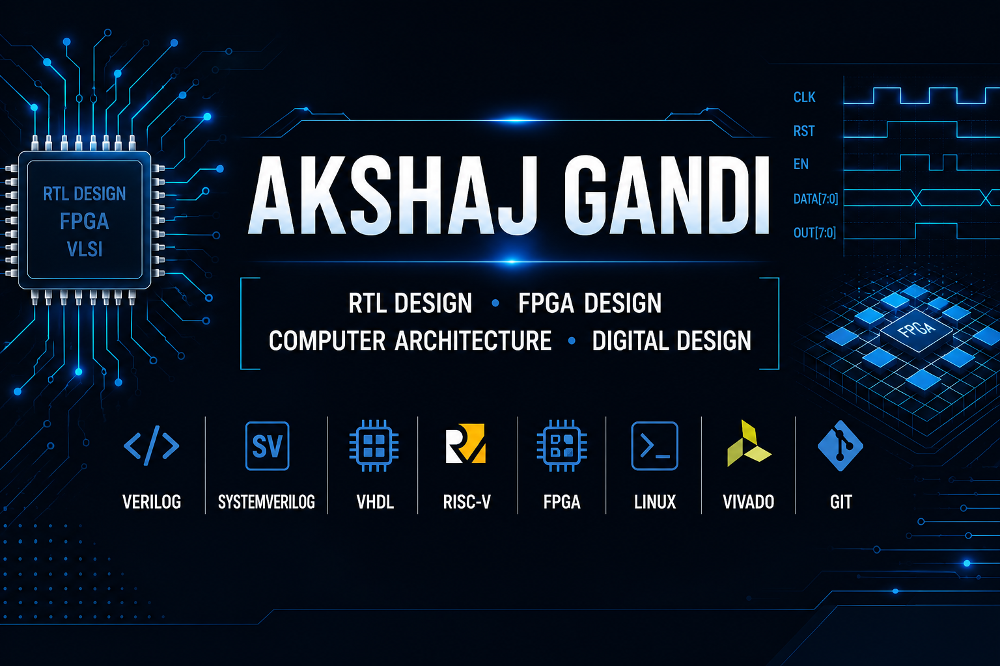

  

<h1 align="center">Akshaj Gandi</h1>

<h3 align="center">
RTL Design • FPGA Design • Computer Architecture • VLSI
</h3>

---

## 👨‍💻 About Me

- 🎓 B.Tech in Electronics & Communication Engineering
- 🏫 SRM Institute of Science and Technology, Tiruchirappalli
- ⭐ CGPA: **9.67/10.00**
- 💻 Passionate about RTL Design, FPGA Design, Digital Design, Computer Architecture, and VLSI
- 🌱 Currently learning **SystemVerilog, Linux and UVM**
- 🎯 Seeking RTL Design, FPGA Design, and Digital Design internship opportunities

---

## 🎓 Education

**Bachelor of Technology (B.Tech.)**
- **Major:** Electronics and Communication Engineering
- **University:** SRM Institute of Science and Technology, Tiruchirappalli
- **CGPA:** **9.67 / 10.00**
- **Expected Graduation:** 2028

---

## 🛠️ Technical Skills

### 💻 Languages

---

### 🧰 Tools & Platforms

---

### ⚙️ Domains

---

## 🎯 Current Focus

- 📘 Learning **SystemVerilog** and **UVM** for RTL verification
- 🐧 Building proficiency in **Linux** for semiconductor development workflows
- ⚡ Strengthening **RTL Design** and **FPGA implementation** skills
- 🧠 Exploring **Computer Architecture** and **RISC-V Processor Design**
- 🎯 Preparing for **RTL Design / FPGA Design / Digital Design internships**

---

## 🎯 Career Objective

Aspiring RTL/FPGA Design Engineer with a strong interest in Digital Design, Computer Architecture, and VLSI. Passionate about designing efficient hardware systems and continuously expanding expertise in SystemVerilog, UVM, and FPGA-based development.

---

## 🎯 Seeking Opportunities

I am actively seeking internships in:

- RTL Design
- FPGA Design
- Digital Design
- Computer Architecture
- ASIC Design & Verification
- VLSI Design

---

## 🚀 Featured Projects

### 🧠 RVV-Inspired RISC-V Vector Processor (RTL Design)

**Technologies:** Verilog • RTL Design • Computer Architecture • Xilinx Vivado

Designed and implemented an RV32I processor with an RVV-inspired vector extension featuring a Vector ALU, Vector Register File, and custom Control Unit. The design was verified through simulation in Xilinx Vivado.

---

### ⚡ Optimized Pipelined Carry-Save Adder (FPGA)

**Technologies:** Verilog • RTL Design • FPGA • Xilinx Vivado

Designed and implemented a 16-bit pipelined Carry-Save Adder optimized for cryptographic arithmetic. Verified through simulation and synthesized using Xilinx Vivado, targeting the Xilinx Artix-7 FPGA platform.

---

### 🧬 Neuromorphic VLSI Architecture (LIF Neuron)

**Technologies:** Verilog • Neuromorphic Computing • Digital Design

Designed and simulated a Leaky Integrate-and-Fire (LIF) neuron architecture for neuromorphic computing, focusing on efficient digital implementation of spiking neural network acceleration.

---

## 📈 GitHub Analytics

## 🔥 Contribution Streak

---

## 🏆 GitHub Trophies

---

## 📜 Certifications

| Certification | Completion |
|---------------|--------|
| Design of Cyber-Physical Systems with ARM Processor using Embedded C | ✅ Completed |
| CPS Design with ARM Core using MicroPython | ✅ Completed |
| CPS Design for Mechatronics, Healthcare, EV & Robotics | ✅ Completed |
| 6G Evolution: Blockchain, Semantic Communications & Radar | ✅ Completed |

---

## 📄 Resume

<a href="https://raw.githubusercontent.com/akshajsaigandi-ux/akshajsaigandi-ux/main/resume/Akshaj_Gandi_Resume.pdf" target="_blank">

---

## 📫 Connect With Me

---

💡 Passionate about designing efficient digital hardware and continuously learning modern VLSI design methodologies.

---

  

